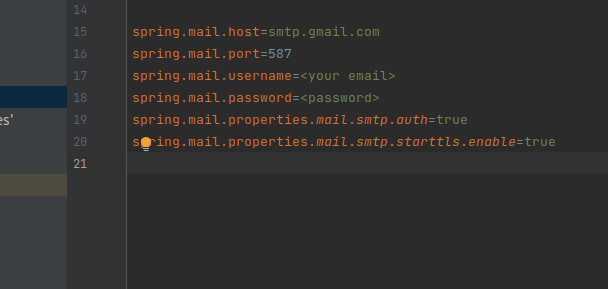

-- application is still in progress --

# Charity
> The application solves a certain problem. Probably each of us has equipment, clothes or toys at home that we do not want to throw away. With the help of this website, we can return these items to the right place;)
## Table of Contents
* [General Info](#general-information)
* [Technologies Used](#technologies-used)
* [Features](#features)
* [Screenshots](#screenshots)
* [Usage](#usage)
* [Project Status](#project-status)
* [Room for Improvement](#room-for-improvement)
* [Contact](#contact)

## General Information
- The program uses the bootstrap template
- After logging in we can choose what we want to give back and order a courier

## Technologies Used
- Java
- Spring Boot
- Spring MVC
- Spring Data JPA
- Spring Security
- Spring Mail
- Hibernate
- MySql
- JavaScript
- JQuery

## Features
-

## Screenshots
![Example screenshot]
![Example screenshot]

## Usage
In order to run the application the repository must be encapsulated and opened in the IDE.
Create SQLDatabase with name:charity_donation.

Then run the main method of the class
`src/main/java/pl/coderslab/charity/CharityApplication.java`

Enter the following address in the browser: `http://localhost:8080/create-admin`

the user "admin" has been created. His login details are:
login: admin@charity.pl
password: admin

Now we can log in and use the application! ;)

To use the version with email verification, you must set up the email configuration.
The default configuration is for Gmail

We can change it in file:
`src/main/resources/application.properties`

Now everythink is fine. U can register new users by form and confirm their account by clicking in link in email

## Project Status
Project is: in progress
